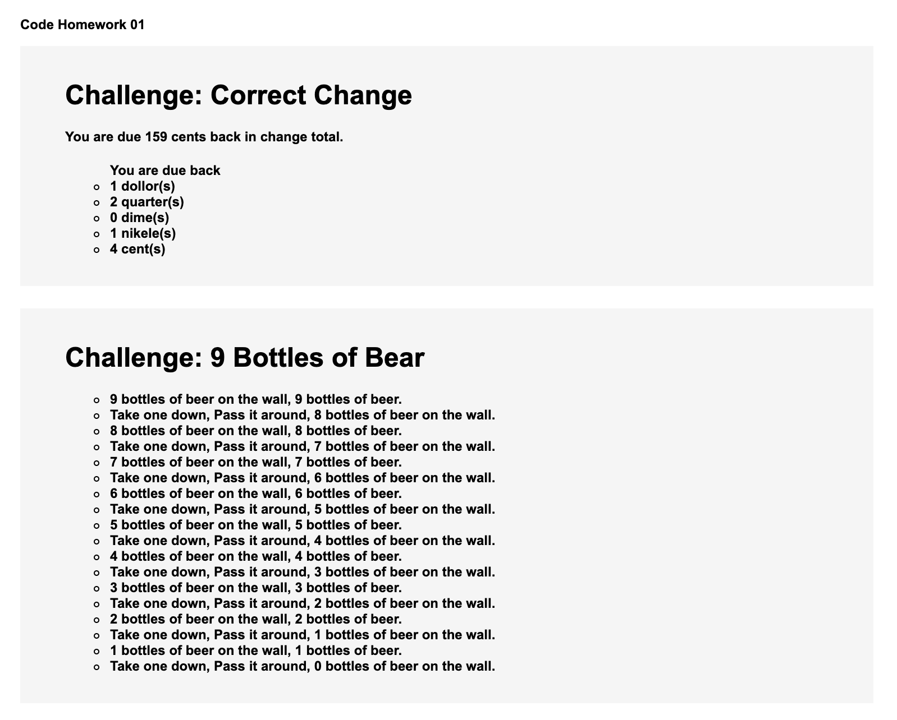
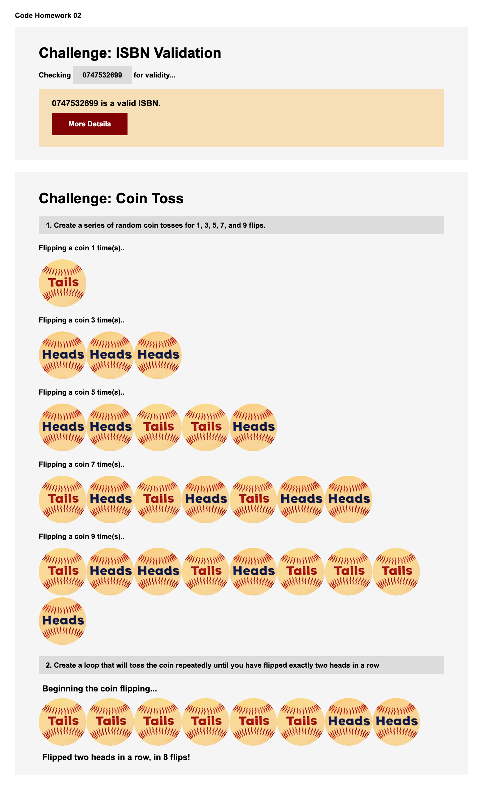
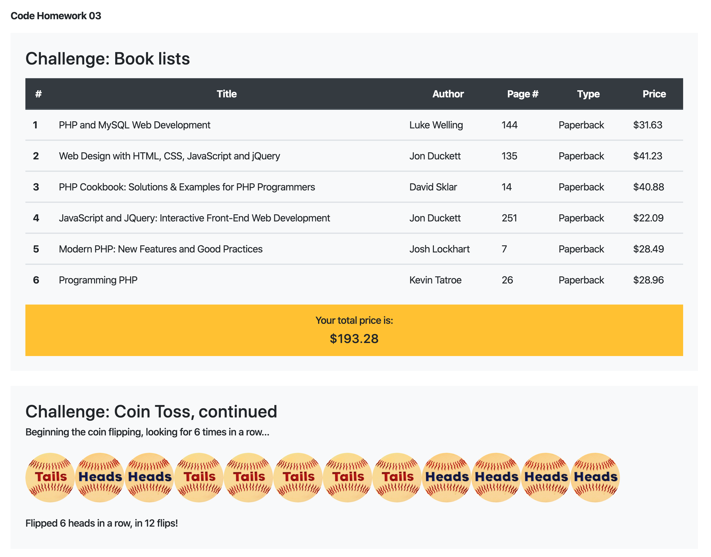

## Where Free Movice @

Background: While we are not allowed to go out and enjoy the most recent movies these days, It could
be beneficial if I collect all the streaming movie data that can be watched at home. A user can briefly skim xx number of movice that xx resources are provided.
He or she can make their preferences whether they want to see the movie or not. Also they can write a review and the ratings as well.

--------------------------------------------------------

## Basic Practice

#### Challenge 1-a: Correct Change
When cashiers in a store give you change they try first try to "fit" dollars into the amount you get back, then try to "fit" quarters (25 cent coins) into what is left over, they try to "fit" dimes (10 cent coins) into what is now left over, then try to "fit" nickels (5 cent coins) into what is left, and finally are left with a few odd cents. For example, say that your change is 159 cents:
Write a program that takes a number representing the change due to a user (in cents) and writes out how many dollars, quarters, dimes, nickels, and pennies she is due in change, e.g. “Your change is: 1 dollar, two quarters, one dime, and three cents”.  You are welcome to add additional PHP/HTML/CSS to improve the design or function of your page.

#### Challenge 1-b: 99 Bottles of Beer
"99 Bottles of Beer" is a song that has a very repetitive format which is easy to memorize, and can take a long time to sing. The song's simple lyrics are as follows:
99 bottles of beer on the wall, 99 bottles of beer.
Take one down, pass it around, 98 bottles of beer on the wall.
The same verse is repeated, each time with one fewer bottle. The song is completed when the singer reaches zero.
i. Write a PHP program that prints the full lyrics of the song on the page. You are welcome to add additional PHP/HTML/CSS to improve the design or function of your page.  
ii. Modify your code, such that you can print out the song for any number of starting beers, e.g. with 4 bottles of beer:

#### Challenge 2-a: Correct Change
An ISBN is a ten digit code which identifies a book. The first nine digits represent the book and the last digit is used to make sure the ISBN is correct.  To verify an ISBN you do the following: 
Obtain the sum of 10 times the first digit, 9 times the second digit, 8 times the third digit... all the way till you add 1 times the last digit.
Divide the sum by 11, if the sum leaves no remainder when divided by 11 the code is a valid ISBN.

#### Challenge 2-b: 99 Coin Toss
i.  The mt_rand() function returns a random value; optionally you may enter a mix and max number to be returned. Create a PHP page that simulates a series of random coin tosses for 1, 3, 5, 7, and 9 flips. You should make your page visually interesting by using images to represent a toss of heads or tails.
ii.  Create a loop that will toss the coin repeatedly until you have flipped exactly two heads in a row. Stop the loop and print out to the page the number of tosses this took.

#### Challenge 3-a: Book lists
Put the following book data into a multi-dimensional array, then use your array to print out the books on the web page in an attractive table (e.g. you may want to color alternating rows differently, etc.)  Somewhere on your page, you should also include the total price, if the user were to purchase all the books listed, e.g. example output (style your table as you wish):

#### Challenge 3-b: Coin Toss, continued
Repeat the coin exercise from HW2, but modify your program to 1) be a function that takes one argument – the number of heads in a row you'd like to flip and then 2) modify your code to use this argument to allow a variable number of heads in a row to be chosen. E.g.  coinToss(8); will flip the coin until 8 heads in a row are obtained.  You should print out the number of heads in a row you are seeking and the total number of flips it took.

