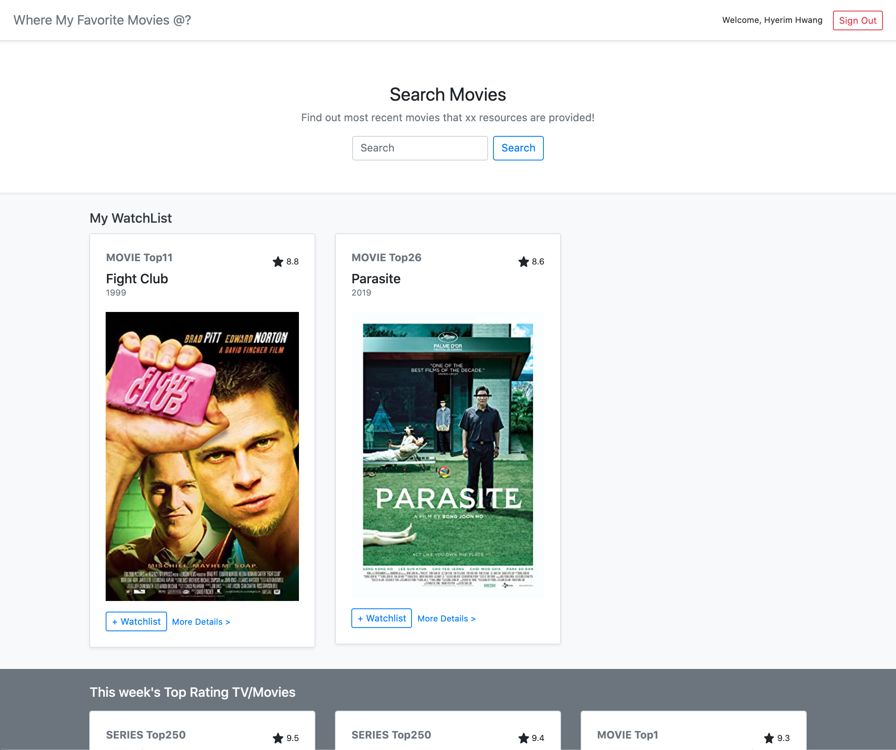
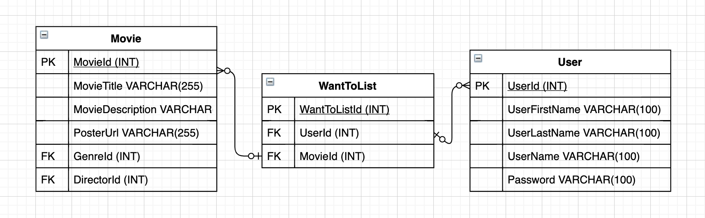
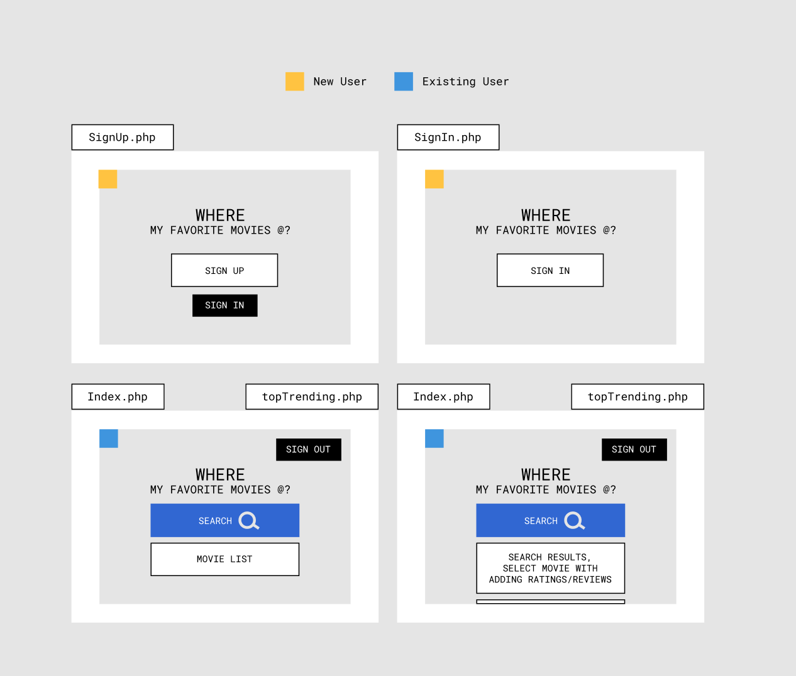

## Where My Favorite Movies @

#### Project Background
While we are not allowed to go out and enjoy the most recent movies these days, It could be beneficial if I collect all the streaming movie data that can be watched at home. A user can briefly skim xx number of movies that xx resources are provided.
He or she can make their preferences whether they want to see the movie or not. Also they can write a review and the ratings as well.

#### Resources

- https://www.imdb.com/
- https://rapidapi.com/rapidapi/api/movie-database-imdb-alternative
- https://rapidapi.com/apidojo/api/imdb8
- https://rapidapi.com/blog/how-to-use-imdb-api/

#### Database

#### Mock-up

